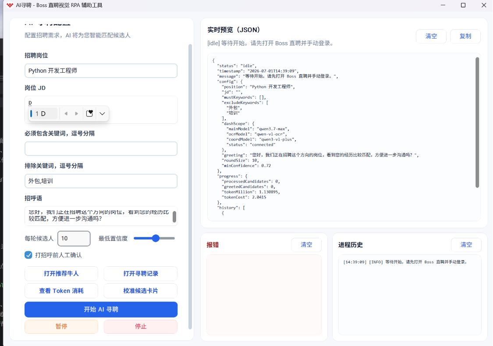
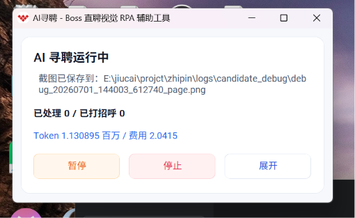
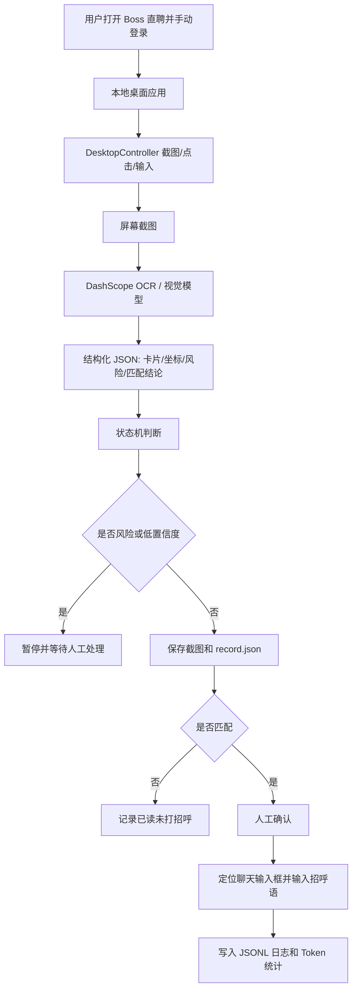

# AI 寻聘视觉 RPA 项目作品集说明

## 项目概述

AI 寻聘是一个面向 Boss 直聘「推荐牛人」场景的本地桌面视觉 RPA 辅助工具。项目目标不是接入平台内部接口，也不是绕过网站限制，而是在用户已经手动登录并打开页面后，通过屏幕截图、视觉识别、OCR、鼠标键盘模拟和人工确认，把候选人浏览、简历截图、岗位匹配判断、打招呼前确认等低频重复流程做成可监督的半自动化工作流。

项目核心价值在于：在不能依赖 DOM、不能注入 JS、页面结构可能变化、且招聘行为需要合规与人工把关的环境下，构建一套可解释、可暂停、可审计的桌面自动化方案。

## 技术栈

| 层级 | 技术选型 | 作用 |
| --- | --- | --- |
| 桌面 UI | Python `tkinter` + `customtkinter` | 构建本地配置面板、运行状态、候选人记录、Token 消耗面板 |
| 桌面控制 | `pyautogui`、`Pillow ImageGrab`、`pyperclip` | 截屏、点击、滚动、键盘输入、中文文本粘贴 |
| 全局监听 | `pynput` | 示教录制、全局停止快捷键 |
| 视觉/OCR | DashScope OpenAI 兼容接口、`qwen-vl-ocr`、`qwen3-vl-plus` | 截图文字提取、候选人卡片识别、按钮坐标定位 |
| 主控推理 | `qwen3.7-max` / `qwen3.7-plus` | 页面状态判断、岗位匹配、风险识别 |
| 记录与审计 | JSONL、PNG 截图、结构化 `record.json` | 保存每轮运行轨迹、候选人截图、AI 分析结果 |
| 配置管理 | `.env` + `python-dotenv` | 管理 API Key、模型名称等运行配置 |

## 选型方法

### 1. 为什么选择视觉 RPA，而不是网页 DOM 自动化

Boss 直聘这类招聘平台具有明显的账号安全和页面风控边界。项目刻意选择「可见屏幕」作为唯一输入源，不读取 DOM、不注入脚本、不绕过验证码，只通过用户可见页面进行截图识别和鼠标键盘操作。

这样选型的原因：

- 合规边界更清晰：工具行为接近人工操作，遇到验证码、账号风险、登录异常立即暂停。
- 对页面结构变化更鲁棒：页面 DOM 类名或结构变化时，视觉模型仍能根据截图理解卡片、按钮、文本。
- 便于人工监督：每一步识别结果、候选人截图和匹配理由都可回看。
- 适合低频流程：招聘沟通本身需要判断和确认，不适合高频、无监督自动化。

### 2. 为什么使用 Python 桌面技术栈

项目运行环境以 Windows 桌面为主，核心能力是控制浏览器和读取屏幕。Python 的 `pyautogui`、`Pillow`、`pynput`、`tkinter` 组合可以快速覆盖截屏、点击、滚动、键盘输入、窗口 UI 和全局热键等需求。

相较于 Electron 或 Web 后台服务，Python 本地应用的优势是：

- 依赖少，部署方式简单，`run.bat` 可直接启动。
- 与 Windows 桌面控制能力结合更直接。
- 适合把图像处理、文件记录、模型调用放在同一个进程内串联。
- 本地运行，不需要额外搭建服务端。

### 3. 为什么拆分多模型职责

项目没有把所有任务都交给单一大模型，而是按任务拆分：

- OCR 模型负责读屏幕文字。
- 视觉坐标模型负责定位候选人卡片、搜索框、打招呼按钮、聊天输入框。
- 主控模型负责页面状态、匹配结论和风险判断。
- 汇总模型负责把候选人截图分析结果整理为招聘记录。

这种拆分降低了单次提示词复杂度，让每个模型调用的输出结构更稳定，也方便在日志中定位是哪一类能力出现问题。

## 技术实现路径

### 1. 本地桌面应用入口

项目入口位于 `zhipin_rpa/__main__.py` 和 `zhipin_rpa/app.py`。启动时会读取 `.env`，创建主窗口 `ZhipinRpaApp`，初始化配置、控制器、LLM 客户端、日志器、状态机、示教录制器和 Token 统计器。

主界面提供：

- 招聘岗位、JD、必须包含关键词、排除关键词、招呼语配置。
- 候选人识别预览、JSON 实时预览、运行历史和错误面板。
- 开始、暂停、停止、校准候选卡片、查看候选人记录、查看 Token 消耗等操作。
- 运行中紧凑悬浮窗，减少遮挡浏览器页面。

### 2. 桌面控制层

`zhipin_rpa/controller.py` 封装了桌面自动化能力：

- `screenshot()` 截取当前屏幕，并记录截图尺寸。
- `click_point()` 将截图坐标转换为实际屏幕坐标后点击，解决 Windows DPI 缩放带来的坐标偏移。
- `click_norm()` 支持 0-1000 归一化坐标点击，便于视觉模型输出与不同分辨率适配。
- `type_text()` 优先使用剪贴板输入中文，必要时逐字输入。
- `human_wait()` 使用随机等待模拟低频人工节奏，降低连续机械操作的风险。

这一层把所有实际鼠标键盘动作集中管理，便于后续统一加安全检查、延迟策略和日志。

### 3. 视觉与 LLM 分析层

`zhipin_rpa/llm_client.py` 是模型能力的主要封装。它通过 DashScope 的 OpenAI 兼容 `/chat/completions` 接口调用不同模型，并强制要求返回 JSON。

主要能力包括：

- `ocr_image()`：读取截图文字，识别风险词。
- `analyze_candidate_list_screenshot()`：识别推荐牛人列表中的候选人卡片，返回姓名、期望岗位、摘要和归一化坐标。
- `analyze_candidate_resume()`：读取连续简历截图，提取候选人信息、技能、经历、匹配结论和按钮坐标。
- `locate_candidate_detail_actions()`：在候选人详情页中定位打招呼按钮和关闭按钮。
- `locate_chat_input()`：确认聊天窗口是否打开，并定位输入框。
- `summarize_candidate_resume_record()`：把候选人记录整理成适合列表展示和回看的摘要。

模型输出统一使用结构化 JSON，并在代码中进行类型检查。如果模型返回结构不符合预期，会抛出错误或进入暂停状态，而不是继续执行不确定操作。

### 4. 状态机与运行控制

`zhipin_rpa/state_machine.py` 定义了基础 RPA 状态流转，例如：

- `IDLE`
- `CAPTURING`
- `SEARCHING`
- `SCANNING_RESULTS`
- `REVIEWING_JOB`
- `REVIEWING_CANDIDATE`
- `NEEDS_CONFIRMATION`
- `PAUSED`
- `STOPPED`
- `ERROR`

状态机负责控制搜索框定位、职位搜索、职位详情识别、匹配判断和打招呼确认等流程。`app.py` 中的候选人分析流程进一步扩展了推荐牛人场景：识别候选人列表、逐个点击卡片、滚动保存简历截图、分析匹配度、写入记录、人工确认后输入招呼语。

状态机设计的重点是「保守执行」：

- 低置信度暂停。
- 识别到验证码、滑块、安全验证、账号风险暂停。
- 按钮歧义或坐标缺失时暂停或跳过。
- 发送前默认弹出人工确认。
- 用户可通过 UI 或 `Alt+T` 全局快捷键停止。

### 5. 候选人简历采集与匹配流程

推荐牛人流程的主要路径如下：

1. 截取当前推荐牛人页面。
2. 调用视觉模型识别候选人卡片。
3. 过滤已经处理或已保存的候选人。
4. 在候选人卡片主体区域内随机选择点击点，避免总是点击同一像素。
5. 打开候选人详情页后，连续截图并滚动，直到识别到简历底部标记或达到保守停止条件。
6. 调用视觉模型分析多张简历截图，提取候选人信息并判断是否匹配岗位。
7. 将截图移动到候选人姓名目录，写入 `record.json`。
8. 异步调用汇总模型生成候选人摘要。
9. 匹配时定位打招呼按钮，弹出人工确认。
10. 确认后打开聊天框，定位输入框并输入招呼语。
11. 关闭详情页，回到列表继续处理下一个候选人。

### 6. 示教录制能力

`zhipin_rpa/teaching_recorder.py` 提供人工示教能力。用户可以手动演示点击、输入、按键等流程，系统记录：

- 鼠标点击坐标。
- 输入文本。
- Enter / Tab 等关键按键。
- 每个动作附近的截图。
- 大模型对动作语义的分析结果。

记录会写入：

- `data/teaching-runs/<时间>/trace.jsonl`
- `data/teaching-runs/<时间>/analysis.jsonl`
- `data/teaching-runs/<时间>/screenshots/*.png`

这个模块让工具具备从人工流程中沉淀操作样本的能力，后续可以用于优化定位提示词、补充回放策略或分析失败案例。

### 7. 日志、审计与成本控制

项目把关键运行数据落盘，便于复盘：

- `data/runs/*.jsonl`：状态变化、模型分析、候选人处理结果、错误信息。
- `logs/candidate_debug/*.png`：候选人列表识别调试截图。
- `logs/candidate_screenshots/<候选人>/`：候选人简历截图和结构化记录。
- `data/token_usage.json`：模型 Token 消耗、价格和估算成本。

`TokenUsageTracker` 按模型累计输入、输出和总 Token，并支持默认价格、自定义价格和总成本统计。对依赖大模型的自动化项目来说，这个设计可以帮助评估单次运行成本和后续优化方向。

## 关键技术点

### 1. 0-1000 归一化坐标体系

视觉模型天然更适合输出相对坐标，而用户屏幕分辨率和 DPI 缩放可能不同。因此项目要求视觉模型返回 0-1000 坐标，再由控制层转换为实际截图像素和屏幕坐标。

这一设计解决了三个问题：

- 不同分辨率下坐标仍可复用。
- 模型提示词更稳定。
- DPI 缩放和截图尺寸差异可以集中在控制层处理。

### 2. 坐标复核与人工校准

搜索框、候选人卡片、聊天输入框等关键点位不完全依赖一次模型输出。项目实现了：

- 搜索框候选点红十字复核。
- 失败后重新定位。
- 候选人卡片手动校准。
- 鼠标坐标追踪工具。
- bbox 主体区域随机点击。

这使得工具在页面布局变化或模型坐标不稳定时仍有人工兜底路径。

### 3. 风险优先的执行策略

项目在提示词和代码两侧都显式处理风险状态。只要看到验证码、滑块、安全验证、账号风险、登录异常、按钮歧义、置信度不足，流程就进入暂停或跳过。

这种设计不是单纯的异常处理，而是产品边界的一部分：招聘沟通属于需要人工判断的场景，自动化应减少重复劳动，而不是替代合规判断。

### 4. 多截图简历理解

候选人简历通常超过一屏。项目不是只分析首屏，而是滚动采集多张截图，并通过底部声明、截图相似度和模型判断来确认内容覆盖情况。

当视觉模型认为简历未完整时，会继续截图；当文本足够时，也可以转为 OCR 文本分析，降低多图模型调用成本。

### 5. 结构化输出与可追踪记录

所有模型调用都要求 JSON 输出，业务层围绕结构化字段做决策，例如：

- `risk`
- `confidence`
- `candidate_cards`
- `candidate`
- `matched`
- `match_reason`
- `greeting_button`
- `close_button`
- `bottom_marker_seen`

这让每一步决策都能在日志中追踪，也方便前端实时展示 JSON 预览。

## 架构示意

## 项目亮点

- 在不依赖 DOM 的前提下，实现了基于屏幕视觉的候选人识别、简历理解和可监督操作。
- 用状态机和风险策略控制自动化边界，避免低置信度或风险页面继续执行。
- 使用多模型分工，提高 OCR、坐标定位、匹配判断和摘要生成的稳定性。
- 支持人工校准、示教录制、全局停止快捷键和发送前确认，增强可控性。
- 完整保存截图、结构化记录、运行日志和 Token 成本，便于复盘和展示工程完整性。

## 可改进方向

- 增加单元测试和模拟截图回放测试，验证坐标转换、JSON 解析和状态流转。
- 抽象模型 Provider 接口，支持更多视觉模型或本地模型。
- 建立失败样本集，用真实截图持续优化提示词和坐标定位策略。
- 将候选人记录导出为 CSV / Excel，方便招聘流程管理。
- 对日志和截图增加脱敏开关，进一步强化隐私保护。

