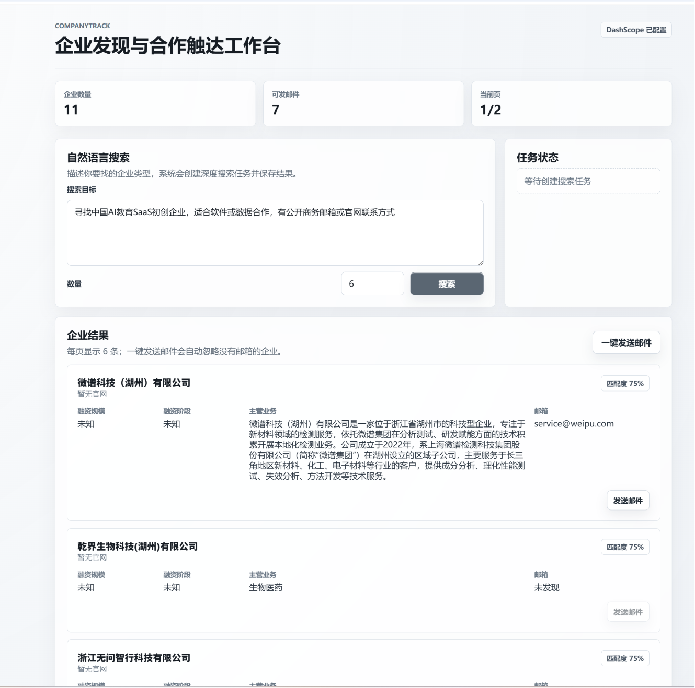

# 项目作品集

## 项目概述

本项目是一个面向实际使用场景设计的完整应用作品，重点展示从需求理解、功能规划、界面组织到交付验证的整体能力。作品集文档仅用于介绍项目价值、设计思路和实现成果，不包含任何核心代码、敏感逻辑或私有配置。

## 项目目标

项目围绕清晰、稳定、易用的体验展开，目标是在有限界面中完成主要业务流程，并让用户能够快速理解当前状态、执行关键操作、获得明确反馈。

## 核心亮点

- 以用户任务为中心组织功能，减少不必要的操作路径。
- 注重界面层级与信息密度，让主要内容更容易被扫描和理解。
- 保持功能模块边界清晰，便于后续维护、扩展和演示。
- 关注交互反馈、异常状态和基础可用性，避免只停留在静态展示。
接入阿里云深入研究模型，通过提示词优化检索路径，用内置联网广泛搜索，用serper补全信息。寻到公司后自动发送合作意向邮件，邮件内部设置追踪按钮，可以收集用户合作意愿。
## 我的工作

在该项目中，我主要负责项目结构梳理、功能体验设计、页面与交互实现、基础测试验证以及交付文档整理。整个过程强调从真实使用角度推进，而不是单纯堆叠功能。

## 技术说明

本作品集不展示核心源码和关键实现细节，仅概括项目采用的工程化思路：模块化组织、可维护的组件结构、清晰的数据流转方式，以及面向迭代的代码管理习惯。

## 项目成果

项目最终形成了一个可演示、可说明、可继续扩展的作品。它能够作为个人作品集中展示工程能力、产品理解和交互落地能力的案例，也方便在面试或项目复盘中快速说明设计取舍与实现成果。
