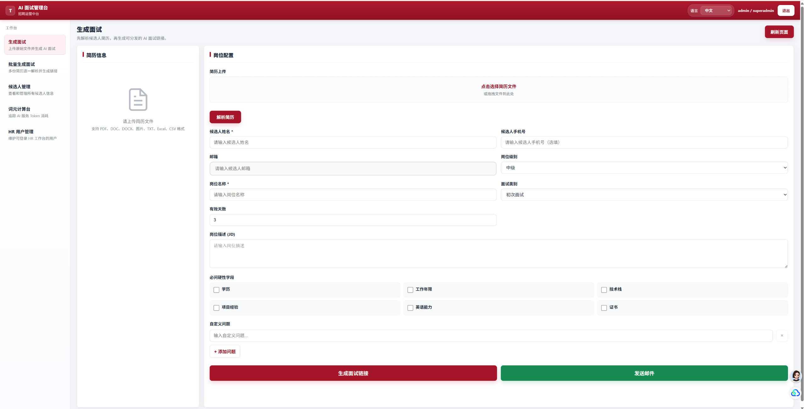
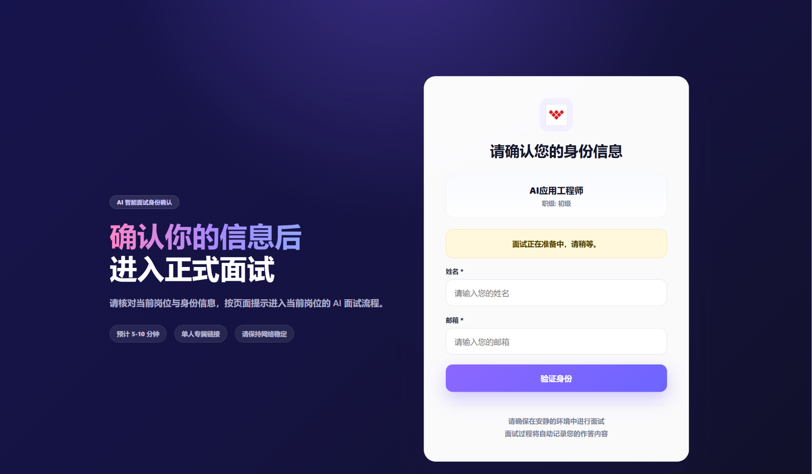
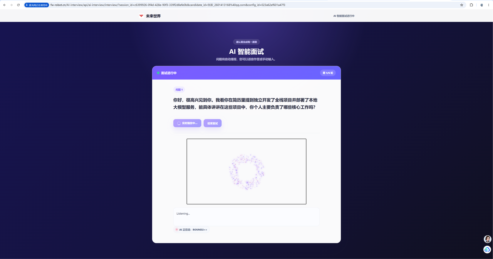

# AI 面试系统作品集说明

## 项目概述

AI 面试系统是一个基于 Django 构建的智能招聘面试平台，面向 HR 创建面试任务、候选人在线参加语音面试、系统自动沉淀面试记录与评估报告的完整场景。项目将岗位信息、候选人简历、结构化面试规则和大语言模型能力结合起来，实现从“创建面试 - 发送链接 - 实时语音问答 - 会话保存 - 报告分析”的闭环流程。

系统的核心目标不是简单地调用 AI 问答，而是让 AI 能够围绕招聘岗位和候选人履历进行有上下文、有轮次、有评价目标的面试，并在面试结束后为 HR 提供可追溯的对话记录和候选人画像。

## 技术栈

| 模块 | 技术选型 |
| --- | --- |
| 后端框架 | Django、Django REST Framework |
| 实时通信 | Django Channels、WebSocket、Daphne |
| AI 能力 | 阿里云 DashScope / 通义千问 Qwen、Omni 实时语音模型、Embedding 模型 |
| 语音能力 | 实时语音输入、ASR 转写、TTS 音频输出 |
| 简历解析 | pdfplumber、pypdfium2、python-docx、openpyxl、Pillow、pytesseract |
| 数据存储 | SQLite 开发环境，支持通过环境变量切换 PostgreSQL |
| 前端实现 | 原生 HTML、CSS、JavaScript |
| 配置管理 | python-dotenv、`.env` 环境变量 |

## 构建思路

### 1. 按招聘业务流程拆分系统

项目围绕真实招聘流程设计模块，而不是只做单一聊天窗口：

1. HR 在后台创建候选人和岗位配置。
2. 系统解析候选人简历，并结合岗位 JD、职级和自定义问题生成面试上下文。
3. 候选人通过面试链接进入身份验证和候选人端页面。
4. 前端通过 WebSocket 建立实时语音连接。
5. AI 面试官根据简历、岗位和规则进行语音面试。
6. 系统保存对话历史、轮次状态、候选人画像和 Token 使用情况。
7. HR 在报告页查看面试记录、分析结果和候选人评估信息。

这种设计让项目更接近完整产品，而不是一个单点 AI Demo。

### 2. 将系统拆成“页面层、接口层、服务层、数据层”

项目整体采用分层结构：

```text
前端页面
  HR 管理页 / 候选人入口 / 面试页 / 报告页
        |
Django Views + REST API + WebSocket Consumer
        |
业务服务层
  会话管理 / Prompt 构建 / 简历解析 / 语音服务 / 模型调用 / 报告分析
        |
数据层
  Candidate / JobConfiguration / TalentProfile / TokenUsage / ExternalAISession
```

其中 `views/` 负责 HTTP 接口和页面入口，`services/` 承担业务逻辑，`consumers.py` 处理实时语音面试 WebSocket，`models.py` 负责核心业务数据持久化。这样的拆分降低了视图层复杂度，也方便后续替换模型、扩展报告或接入外部系统。

### 3. 采用“Omni 主导 + Python 透传”的实时面试模式

实时面试部分的核心设计是让 Omni 实时模型负责面试中的智能判断，Python 后端主要负责连接、透传、状态保存和兜底控制。

具体来说：

- 前端采集候选人音频，通过 WebSocket 发送到 Django Channels。
- `VoiceInterviewConsumer` 将音频转换为实时模型需要的格式并转发给 Omni。
- Omni 完成语音识别、语义理解、问题生成和语音回复。
- 后端接收模型返回的音频流和文本流，再实时推送给前端。
- 每次 AI 或候选人发言都会写入对话历史，用于断点续面和报告生成。

这种方式避免后端用大量规则硬编码面试判断，把“是否追问、是否进入下一轮、问题如何表达”交给模型，同时保留后端对会话结束、轮次显示、异常断开、手动结束的控制能力。

## 核心功能实现

### HR 面试配置

HR 可以创建岗位配置，配置内容包括岗位名称、岗位描述、职级、目标职位、面试类型、招聘要求、硬性字段和自定义问题。系统会生成公开访问用的 `config_id`，候选人通过链接进入对应面试。

对应数据主要由 `JobConfiguration` 承载，并通过候选人、评估组等模型建立关联，支持同一候选人在不同岗位或评估批次下进行面试。

### 候选人和评估组管理

系统使用 `Candidate` 保存候选人基础信息，使用 `AssessmentGroup` 表示一次“候选人 - 岗位”的评估批次。这样可以把初次面试、面谈、报告和后续分析归档到同一个评估上下文中，方便 HR 对比和管理。

### 简历解析

简历解析服务支持 PDF、Word、图片、TXT、Excel 等多种格式。系统会尽量将不同格式转换为结构化简历 JSON，并提取摘要、项目经历、技能、教育背景等信息。解析后的简历会进入面试 Prompt，用于驱动后续问题生成。

实现上，项目根据文件类型选择不同解析方式：

- PDF 使用 `pdfplumber`、`pypdfium2`。
- Word 使用 `python-docx`。
- 图片使用 OCR 能力。
- Excel/CSV 使用表格读取能力。
- 对复杂内容可结合 Qwen 文本或视觉模型做结构化抽取。

### 结构化初次面试

初次面试采用六轮结构：

| 轮次 | 目标 |
| --- | --- |
| 1. 硬性指标补全 | 验证学历、经验、证书等基础条件 |
| 2. 项目角色真实性 | 判断简历项目经历是否真实 |
| 3. 项目角色深度 | 考察候选人在项目中的实际贡献 |
| 4. 技能偏差验证 | 检查技能与岗位要求的匹配程度 |
| 5. 语言逻辑能力 | 评估表达、逻辑和沟通能力 |
| 6. 自定义问题 | 追问 HR 额外关心的问题 |

系统会根据 HR 是否配置硬性字段、自定义问题等信息动态跳过部分轮次。面试 Prompt 中会写入岗位、职级、简历摘要、项目经历、技能和追问规则，让模型能围绕目标维度发问。

### 面谈模式

除标准化初面外，系统还支持开放式面谈模式。面谈模式下，HR 输入的招聘要求拥有最高优先级，模型不再严格按照六轮流程推进，而是围绕招聘要求进行更自然的开放对话。后端仍然保留结束条件、默认轮数兜底和会话保存能力。

### 实时语音面试

实时语音面试是项目最核心的交互链路：

```text
候选人说话
  -> 浏览器采集音频
  -> WebSocket 发送音频片段
  -> Django Consumer 透传给 Omni
  -> Omni 实时识别和生成回复
  -> 后端接收文本 delta 和音频 delta
  -> 前端同步展示文字并播放语音
```

后端还处理以下细节：

- VAD 语音活动检测参数配置。
- 用户打断 AI 回复。
- 手动结束面试。
- 音频缓冲提交。
- 断开连接时保存最终会话状态。
- 根据回复中的轮次标记更新前端轮次显示。

### 会话保存与断点续面

系统使用 `SessionManager` 管理会话状态，并通过 `TalentProfile` 将关键结果持久化。保存内容包括：

- `session_id`
- 候选人 ID
- 当前轮次
- 对话历史
- 上一个问题
- 简历 JSON
- 岗位配置 JSON
- 硬性字段结果
- 项目角色结果
- 面试是否完成
- 未完成原因

当候选人刷新页面或连接中断后，系统可以读取历史记录，构造断点续面的 Prompt，让 AI 从已有上下文继续面试。

### 报告与画像

面试结束后，系统基于对话历史、简历信息和岗位配置生成候选人画像与报告数据。报告侧重点包括：

- 面试问答记录。
- 候选人回答质量。
- 项目经历真实性和深度。
- 岗位匹配度。
- 自定义问题回答。
- 面试完成状态。
- 可信度评分。

这些结果为 HR 后续筛选提供结构化依据。

### Token 统计与成本观测

项目设计了 `TokenUsage` 模型记录不同类别的模型调用消耗，包括简历解析、岗位匹配、Omni 语音面试、回答分析、飞书助手和 Embedding。后台提供 Token Dashboard，用于查看调用次数、输入 Token、输出 Token 和总消耗，便于后续成本评估和优化。

### 外部系统与飞书集成

系统提供外部 AI 面试任务接口，支持第三方系统创建面试、查询报告、查看转写记录，并通过回调同步结果。`ExternalAISession` 用于保存外部请求、候选人映射、岗位配置、回调状态和结果数据。

同时项目预留飞书事件回调能力，可以扩展到企业内部协作场景，例如通过飞书触发面试任务或查询候选人信息。

## 数据模型设计

项目核心模型包括：

| 模型 | 作用 |
| --- | --- |
| `AdminUser` | 管理员账号 |
| `HRUser` | HR 控制台账号 |
| `Candidate` | 候选人基础信息 |
| `AssessmentGroup` | 候选人与岗位的一次评估批次 |
| `JobConfiguration` | 岗位、职级、JD、面试类型、硬性字段、自定义问题等配置 |
| `TalentProfile` | 面试会话、对话历史、候选人画像和评估结果 |
| `ExternalAISession` | 外部系统创建的 AI 面试任务映射 |
| `TokenUsage` | 模型调用 Token 统计 |

整体设计上，岗位配置和候选人信息解耦，面试结果通过会话和评估组沉淀，便于同一候选人多岗位、多轮次、多场景复用。

## 项目亮点

1. **完整业务闭环**：覆盖 HR 创建、候选人面试、AI 实时问答、报告分析和外部系统回调。
2. **实时语音体验**：使用 WebSocket + Omni 实时模型实现语音输入、转写、文本流和音频流同步返回。
3. **Prompt 驱动面试流程**：将面试规则、岗位要求、职级差异和简历上下文集中写入 Prompt，提高流程灵活性。
4. **支持两类面试模式**：既能做六轮结构化初面，也能做开放式面谈。
5. **多格式简历解析**：兼容 PDF、Word、图片、TXT、Excel 等简历来源。
6. **可恢复会话**：支持对话历史保存和断点续面，减少网络中断对面试流程的影响。
7. **可观测成本**：记录不同 AI 调用场景的 Token 消耗，方便成本控制。
8. **具备集成能力**：提供外部 API、回调和飞书事件入口，适合接入企业招聘系统。

## 实现难点与解决方法

### 实时语音流稳定性

难点在于候选人音频、AI 文本、AI 音频都具有流式特征，前后端必须保持低延迟同步。项目通过 Django Channels 建立 WebSocket 通道，将音频片段直接透传给 Omni，并把模型返回的文本 delta 和音频 delta 分别推送到前端，降低中间处理成本。

### 面试流程控制

如果完全由后端规则控制，逻辑会非常复杂；如果完全交给模型，又容易缺少状态约束。项目采用折中方案：模型主导问题生成和追问判断，后端负责记录状态、识别结束语、保存轮次、处理强制结束和异常恢复。

### 简历信息结构化

候选人简历格式差异大，单一解析方式不可靠。项目按文件类型拆分解析策略，并结合大模型进行结构化抽取，最终统一为 JSON，供面试 Prompt 和报告分析复用。

### 会话恢复

实时面试中断后，系统需要知道当前说到哪里、上一轮问题是什么、是否已经结束。项目将对话历史和关键状态持久化到 `TalentProfile`，恢复时根据历史重新构建上下文，让模型继续面试。

## 可展示成果

在作品集中可以重点展示以下页面或流程：

- HR 后台创建岗位和候选人。
- 候选人通过链接进入面试。
- 实时语音问答界面。
- 面试完成后的报告页。
- Token 统计后台。
- 简历解析和岗位匹配结果。

## 总结

该项目体现了一个 AI 应用从模型能力接入到业务产品落地的完整过程。系统不仅实现了大模型问答，还围绕招聘场景完成了简历解析、岗位配置、实时语音交互、结构化面试、会话持久化、报告生成、成本统计和外部集成等工程化能力，适合作为展示 AI 产品开发、Django 后端开发和实时交互系统设计能力的作品集项目。
