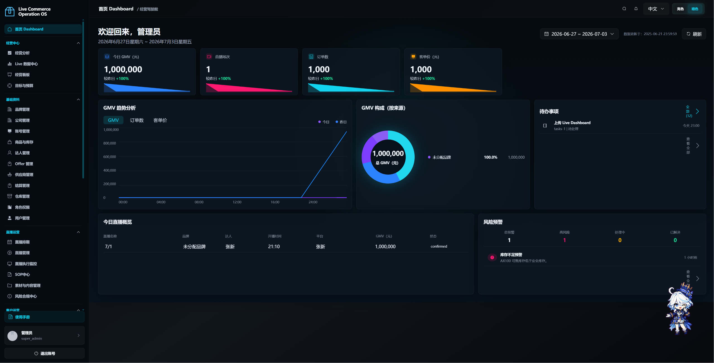
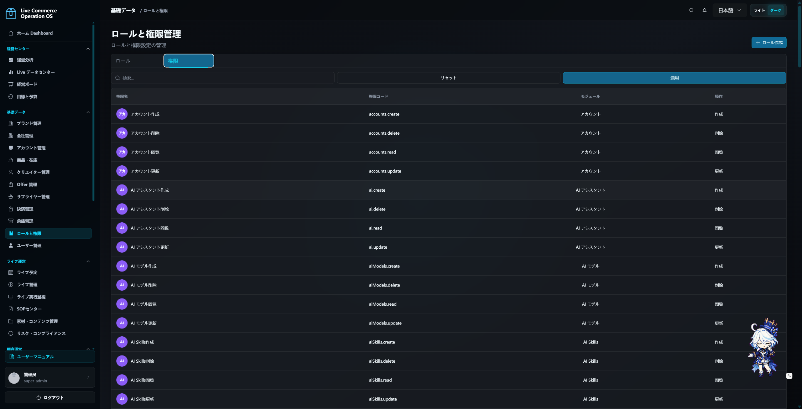
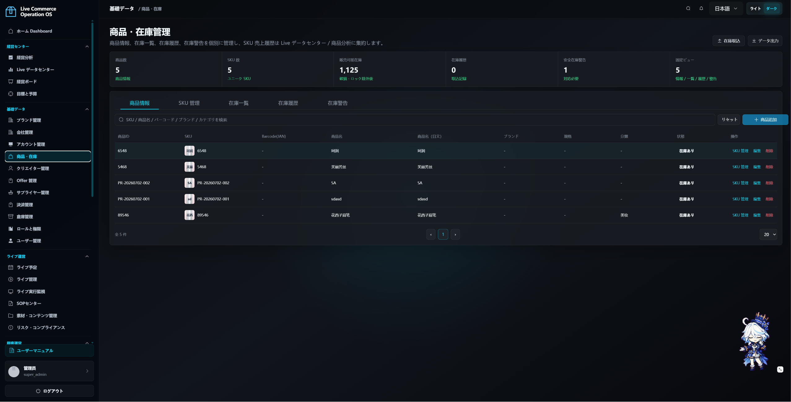
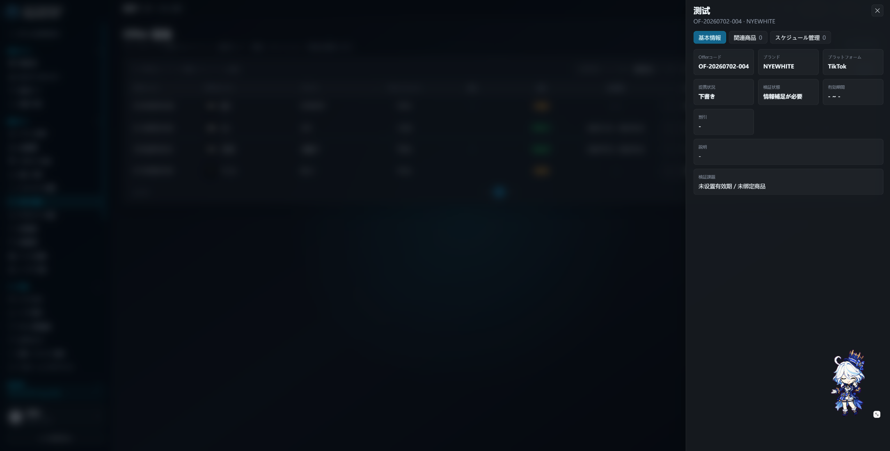
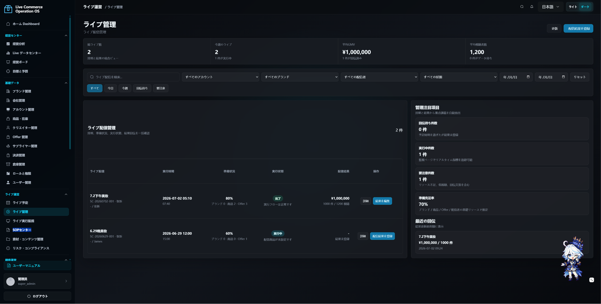
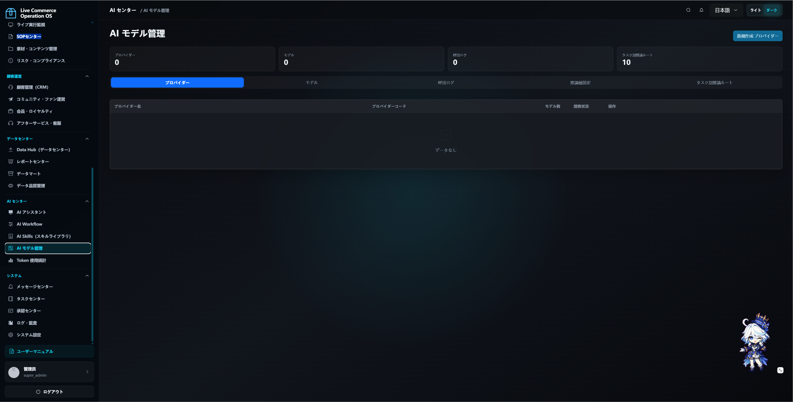

# LiveOA — 日本直播电商运营平台

> 面向日本 TikTok Shop / TikTok Live 场景的全链路运营系统，覆盖品牌、商品、达人、排期、直播执行、结算、复盘的完整 SOP 闭环。

---

## 项目概况

| 维度 | 说明 |
|------|------|
| 业务领域 | 日本直播电商（Live Commerce） |
| 目标市场 | 日本 / 面向多语言团队 |
| 技术栈 | Vue 3 + TypeScript（前端）/ NestJS + Fastify + Prisma（后端）/ PostgreSQL / OpenAI API |
| 架构模式 | Monorepo（npm workspaces）、前后端分离、RESTful API |
| 国际化 | 中 / 日 / 英 三语实时切换，分文件 i18n 方案 |
| 部署方式 | Docker 多阶段构建 + docker-compose 一键启动 |

---

## 技术能力一览

### 1. 全栈架构设计

#### 后端（NestJS + Fastify + Prisma）

- **模块化架构**：按业务域拆分为 `master-data`、`operations`、`creators`、`finance`、`live-data`、`live-management`、`platform`、`ai`、`users` 等独立模块，每个模块拥有独立的 Controller / Service / DTO 层
- **Prisma ORM**：1700+ 行 Schema 定义，涵盖 50+ 张数据表，涵盖品牌、商品、SKU、达人、排期、直播、结算、利润核算、佣金规则、SOP 模板、风险记录等完整业务模型
- **通用 CRUD 抽象**：`useCrudList` Composable（前端）+ 分页查询 DTO（后端）统一封装，所有列表页共享分页、搜索、排序、删除确认逻辑
- **BigInt 序列化**：自定义 `bigint-interceptor` 解决 Prisma BigInt 类型与 JSON 序列化不兼容问题
- **权限守卫（JwtAuthGuard）**：基于 JWT 的身份验证 + 基于 URL 路径自动推断权限模块的中间件机制，无需在每个 Controller 上手动标注权限

#### 前端（Vue 3 + TypeScript + Element Plus）

- **Composition API + `<script setup>`**：全部页面使用 Vue 3 Composition API，无 Options API 代码
- **统一请求拦截器**：基于 `fetch` 的全局拦截器，统一处理 30 秒超时、401 自动跳转登录页、错误信息国际化映射
- **主题系统**：支持亮色 / 暗色主题切换，全局 CSS 变量驱动
- **按需代码分割**：Vite 构建配置中手动分割 `echarts`、`xlsx`、`element-plus`、`vue` 等大依赖为独立 chunk

---

### 2. 核心业务模块实现

#### 🏢 基础资料管理（品牌 / 公司 / 供应商 / 仓库）

- **CRUD + 搜索 + 分页 + 导出**的标准页面模板
- 品牌与公司多语言字段（`nameJa` / `nameZh` / `nameEn`）
- 仓库支持多类型（普通仓 / 保税仓 / 海外仓），关联库存查询

#### 📦 商品与库存管理

- **商品主数据**：支持品牌关联、多规格 SKU、图片上传、Excel 批量导入
- **SKU 二级面板设计**：商品详情中嵌套 SKU 列表，支持增删改查，通过事务保证原子性
- **库存流水管理**：入库 / 出库 / 调整 / 锁定 / 解锁 / 报损六种流水类型
- **多仓库库存**：库存按仓库维度聚合，支持库存总览、可用库存、锁定库存多维查看

#### 🎯 Offer 管理

- **商品组合管理**：一个 Offer 关联多个商品，支持引流款 / 主推款 / 利润款 / 信任款角色分类
- **价格与有效期**：支持折扣类型（百分比 / 固定金额）、有效期范围、平台限定
- **双向关联**：Offer ↔ 直播排期双向绑定，任一端修改自动同步

#### 📅 直播排期管理

- **完整排期流程**：创建排期 → 绑定达人、品牌、商品、Offer、SOP 模板 → 前日确认 → 当日执行 → 结果回填
- **状态机管理**：draft → scheduled → in_progress → completed / cancelled
- **多场联动**：一个排期可关联多个 Offer、多个商品，支持 SOP Checklist 自动生成
- **Checklist 引擎**：根据 SOP 模板自动生成排期级检查清单，支持逐项标记完成状态

#### 🎬 直播执行与监控

- **实时直播列表**：展示当前正在进行的直播场次
- **今日排期面板**：汇总当天所有场次的准备状态
- **达人 / 品牌 / 商品绩效排行**：基于历史 GMV 数据的多维度排行分析
- **直播结果录入**：手动填写整场 GMV、订单数、观看人数、峰值在线，以及逐商品的 GMV / 订单 / 销量明细

#### 💰 结算与利润核算

- **结算单管理**：关联排期与品牌，记录收入、成本、利润
- **利润计算模型**：GMV - 商品成本 - 佣金 - 平台费 - 广告费 - 样品费 - 物流费 = 净利润
- **审批流程**：结算单需经过审批后才能确认，支持审批中心查看待办

#### 👤 达人管理

- **达人档案**：基础信息 + 多平台账号绑定 + 合同管理 + 标签系统
- **佣金规则引擎**：支持 4 种佣金类型（固定百分比 / 固定金额 / 阶梯百分比 / 混合），按达人独立配置，含生效时间范围
- **自动评级系统**：根据月度 GMV 自动计算 S / A / B / 未评级四个等级
- **培训状态跟踪**：独立的培训进度管理（未开始 / 已安排 / 进行中 / 已完成）

#### 📊 Dashboard 数据看板

- **聚合统计**：直播 GMV、订单数、场次、可售库存、广告 ROAS 等核心指标
- **品牌 GMV 排行 + 达人 GMV 排行**
- **趋势图表**：基于 ECharts 的折线图展示近期趋势
- **实时排期概览**：显示即将到来的直播场次

#### 📈 Live 数据中心

- **多维度分析**：按日期 / 达人 / 品牌 / 商品四个维度分析直播数据
- **达人分析**：GMV、GMV/h、CTR、CVR、ROI 多维指标
- **商品分析**：SKU 级销量、GMV、退款、库存周转
- **截图 OCR**：支持上传直播后台截图，AI 自动识别 GMV 和订单数

---

### 3. 权限与安全体系

#### RBAC 权限模型

- **角色管理**：预设 super_admin / ops_director / gm / am / finance / data_analyst 六种角色，支持自定义角色
- **细粒度权限**：50+ 个权限点，覆盖每个模块的 read / create / update / delete 操作
- **权限持久化同步**：`seed.ts` 中 `syncPermissions()` 函数每次启动自动 upsert 缺失的权限记录，确保代码定义与数据库一致
- **数据范围控制**：支持按品牌、账号、达人 ID 为用户配置数据访问范围

#### 认证安全

- **JWT Token 认证**：Bearer Token 机制，30 分钟过期自动刷新
- **Fetch 全局拦截**：统一处理 401 响应，自动清除本地 Token 并跳转登录页
- **请求超时保护**：所有 API 请求 30 秒超时，超时后显示国际化错误提示
- **防重复跳转**：`isRedirecting` 锁防止并发 401 响应导致多次页面跳转

---

### 4. AI 智能能力

#### AI 智能助手

- **对话式交互**：基于 OpenAI API 的聊天助手，支持上下文对话
- **工具调用（Tool Use）**：AI 可调用系统内置工具查询数据、执行操作，基于用户权限控制可调用范围
- **权限感知**：工具调度器（ToolDispatcherService）接收用户上下文（角色、权限、数据范围），确保 AI 只能操作用户有权限的数据

#### AI 模型管理

- **多模型支持**：支持配置多个 OpenAI API Key 和模型
- **推理层（Inference Tier）配置**：chat / reasoning / code / summary / embedding 五种推理层级，每层可独立配置模型、最大 Token、温度
- **Token 用量统计**：按用户、来源（对话 / 技能 / 工作流）记录每次调用的 Prompt / Completion Token 消耗

#### AI 技能库 & 工作流

- **技能定义**：可配置的 AI Skill，带参数 Schema 定义
- **工作流编排**：支持定义多步骤 AI 工作流，每步可配置不同的推理层和参数

#### 智能导入

- **Excel 解析**：支持上传 Excel 原始表，后端解析行数据
- **AI 数据映射**：利用 AI 自动识别列含义并映射到系统字段

---

### 5. 平台级功能

#### 导入中心

- **异步导入任务**：支持大文件异步导入，后台处理，完成后通知
- **导入进度追踪**：总行数 / 成功行数 / 失败行数实时反馈
- **文件存储**：上传文件以 BLOB 形式持久化，支持重新解析

#### 系统备份与恢复

- **全平台导出**：一键导出所有数据库表数据 + 服务器文件为 ZIP 包
- **全平台恢复**：通过导入 ZIP 备份包覆盖当前数据，含表结构和文件还原
- **备份概览**：展示当前备份范围包含的文件数量

#### 审批中心

- **通用审批流引擎**：支持定义审批流程模板，实例化后按节点逐级审批
- **待办通知**：审批待办与消息中心集成

#### 审计日志

- **操作记录**：记录用户的关键操作（创建、修改、删除）
- **可追溯**：每条日志包含操作人、时间、操作类型、目标资源

#### 风险合规中心

- **风险记录管理**：记录直播中的违规、缺货、误价等问题
- **闭环处理**：风险记录支持状态流转（待处理 → 处理中 → 已解决 → 已关闭）
- **通用模块模型**：基于 `ModuleRecord` 通用表，灵活支持多种风险类型

#### 目标与预算管理

- **年度目标拆解**：按月 / 按类型（GMV / 利润 / 场次）拆解年度目标
- **达成率追踪**：自动汇总实际数据与目标对比
- **年度趋势图**：ECharts 折线图展示月度目标 vs 实际走势

#### SOP 中心

- **模板管理**：创建 SOP 模板，定义检查项分类（直播前 / 直播中 / 直播后）
- **Checklist 生成**：从模板生成排期级 Checklist，支持替换已有清单
- **逐项标记**：每个检查项可标记完成状态，支持必填 / 选填区分
- **默认模板**：支持创建空默认模板，后续补充检查项

---

### 6. 国际化方案

- **三语支持**：中文 / 日文 / 英文，所有 UI 文本均可切换
- **分文件架构**：`locales/zh.ts`、`locales/en.ts`、`locales/ja.ts` 三个独立翻译文件（各 2800+ 行），`locale.ts` 作为精简入口
- **运行时切换**：`useLocale()` Composable 提供响应式语言切换，偏好存储到 localStorage
- **API 错误信息国际化**：后端错误码通过前端映射表转换为对应语言的友好提示

---

### 7. 数据导入导出

- **Excel 导入**：基于 `xlsx` 库的通用导入引擎，支持行级错误记录
- **Excel 导出**：各模块列表页均支持数据导出
- **批量操作**：商品、达人、排期等模块支持批量数据导入

---

### 8. 通知与消息

- **站内通知**：消息中心支持系统通知推送
- **LINE / 飞书集成**：公司管理中支持配置 LINE 和飞书账号，为外部通知预留接口

---

## 实现思路亮点

### 权限自动推断机制

传统做法需要在每个 API 接口上标注所需权限，维护成本高。本项目通过 **URL 路径正则匹配**自动推断权限：

```
POST /api/companies → 推断需要 companies.create
PUT /api/companies/:id → 推断需要 companies.update
GET /api/companies → 推断需要 companies.read
```

在 `JwtAuthGuard` 中统一处理，大幅减少重复的权限注解代码。

### 通用 CRUD Composable

前端通过 `useCrudList<T>()` 封装了完整的列表页逻辑（分页、搜索、加载、删除），所有模块的列表页只需传入 `loader` 和 `deleter` 函数即可复用，减少 70% 以上的重复代码。

### 种子数据自同步

`seed.ts` 中的 `syncPermissions()` 采用 upsert 策略，每次应用启动自动比对代码定义与数据库中的权限列表，新增缺失权限，无需手动执行迁移脚本。

### ModuleRecord 通用模块

对于风险记录、任务、提醒等非核心但需要统一管理的模块，采用 `ModuleRecord` 通用表设计，通过 `moduleKind` 字段区分类型，`payloadJson` 存储业务数据，避免为每个小模块单独建表。

### Fetch 全局拦截 + 双信号合并

请求拦截器同时处理超时控制和用户取消两种信号，通过 `mergeSignals()` 函数将多个 AbortSignal 合并为一个，确保超时和用户主动取消都能正确触发。

### 直播结果多维度录入

直播结束后，运营人员从 TikTok Shop 后台复制实际成交数据，手动填入整场和逐商品的 GMV / 订单 / 销量。这种设计覆盖了优惠券、满减、组合价等实际交易差异，比自动计算更准确。

---

## 技术栈详情

| 层级 | 技术 |
|------|------|
| 前端框架 | Vue 3.5 + TypeScript 5.8 |
| UI 组件库 | Element Plus |
| 图表 | ECharts |
| 表格导出 | SheetJS (xlsx) |
| 构建工具 | Vite 6 |
| 后端框架 | NestJS 11 + Fastify |
| ORM | Prisma 6 |
| 数据库 | PostgreSQL |
| AI 接口 | OpenAI API (openai SDK) |
| 认证 | JWT (@nestjs/jwt) + bcrypt |
| 容器化 | Docker + docker-compose |
| 包管理 | npm workspaces (Monorepo) |
| 代码检查 | vue-tsc (TypeScript 类型检查) |

---

## 项目规模

| 指标 | 数值 |
|------|------|
| 前端页面数 | 43 个 Vue 视图组件 |
| 后端模块数 | 10 个业务模块 |
| 数据库表数 | 50+ 张表 |
| API 接口数 | 100+ 个 RESTful 端点 |
| 翻译键数 | 2800+ 条（每语种） |
| 代码总行数 | 前端 ~35,000 行 + 后端 ~15,000 行 |
