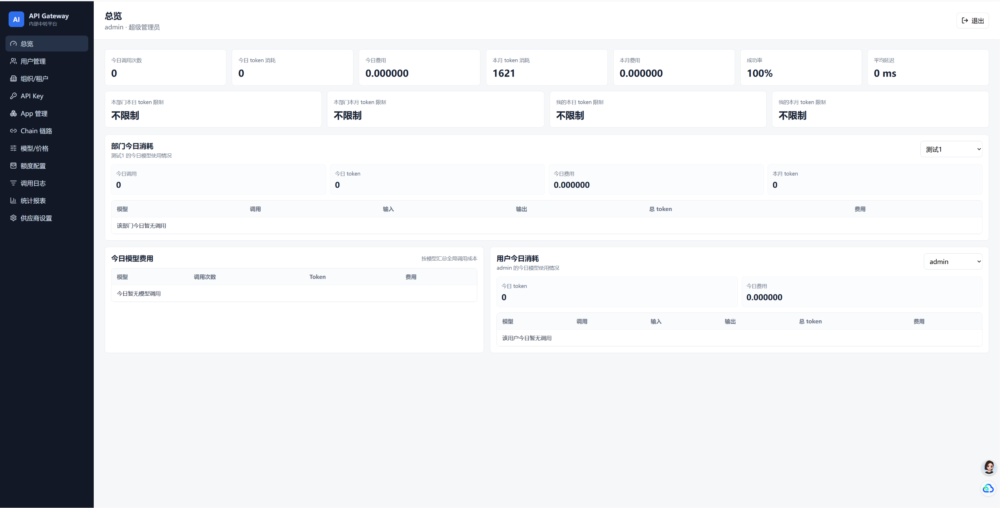
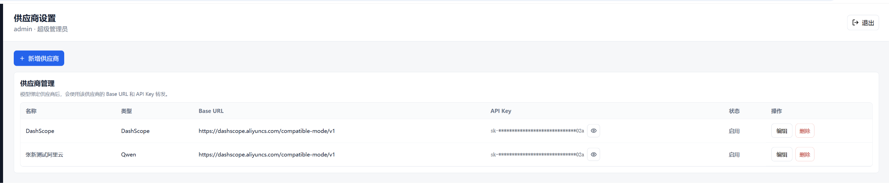
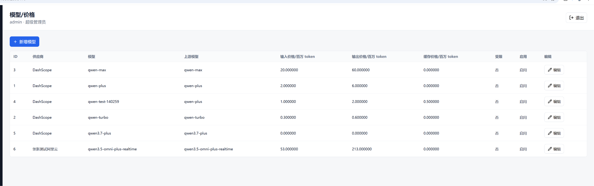
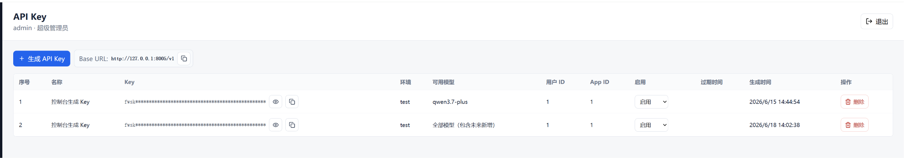
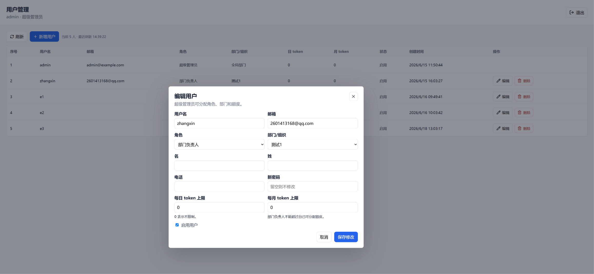

# AI API 中转与用量治理平台：作品集说明

## 项目概述

本项目是一个面向公司内部的 AI API 中转平台，目标是把外部大模型供应商能力封装成统一、可管理、可审计的内部 API 服务。调用方只需要使用内部生成的 `fwsk_test_xxx` / `fwsk_live_xxx` API Key，并按照 OpenAI SDK 兼容方式访问 `/v1/models` 和 `/v1/chat/completions`，即可调用后端配置的 DashScope/Qwen 等上游模型。

平台不仅解决“统一转发”的问题，还围绕企业内部使用 AI 的真实管理需求，加入了用户角色、组织隔离、API Key 管理、模型权限、链路绑定、额度控制、调用日志、成本统计和前端管理台。



## 项目定位

这个项目更像一个“企业内部 AI 网关 MVP”，而不是简单的模型调用 Demo。它抽象出三类核心诉求：

1. **统一入口**：屏蔽不同供应商的密钥、地址和模型差异，对内部提供 OpenAI 兼容接口。
2. **安全治理**：真实供应商 Key 只保存在后端环境变量或供应商配置中，调用方只能拿到内部 Key。
3. **可观测和可计费**：记录每次请求的用户、组织、应用、链路、模型、Token、费用、状态和延迟，支持后续统计和导出。

## 技术栈

### 后端

- Django 6
- Django REST Framework
- Simple JWT
- SQLite
- httpx
- python-dotenv
- openpyxl

### 前端

- React
- Vite
- lucide-react
- 原生 CSS 模块化页面样式

### 上游模型接口

- DashScope OpenAI 兼容接口
- 预留 OpenAI、DeepSeek、自定义 OpenAI-Compatible Provider 扩展能力

## 系统架构思路

整体上采用“管理后台 + OpenAI 兼容网关 + 用量日志中心”的结构：

```text
调用方 / OpenAI SDK
        |
        | Bearer fwsk_xxx
        v
/v1/models 或 /v1/chat/completions
        |
        v
网关层 gateway
  - 内部 API Key 认证
  - 模型权限校验
  - Chain 链路解析
  - 额度检查
  - 上游 Provider 转发
  - 成功/失败/拒绝日志记录
        |
        v
DashScope / OpenAI-Compatible Provider

管理后台 React
        |
        v
DRF 管理 API
  - 用户 / 角色 / 权限
  - 组织 / App / Chain
  - API Key / 模型价格 / 额度
  - 日志 / 看板 / 报表
```

这种拆分让“调用链路”和“管理链路”保持相对独立：调用方访问 `/v1` 兼容接口，管理人员访问 `/api` 后台接口，前端只承担配置和观察的交互职责。

## 核心实现路径

### 1. 设计内部 API Key 体系

内部 Key 采用 `fwsk_{env}_{token}` 格式，通过 `APIKey.generate_raw_key()` 生成，区分测试和生产环境。数据库侧保存：

- `key_prefix`：用于列表展示和快速识别。
- `key_hash`：完整 Key 的 SHA-256，用于认证匹配。
- `raw_key_plaintext`：当前项目中保留了明文字段，便于本地 MVP 调试；作品化或生产化时应改为只在创建时返回一次，数据库不再保存完整 Key。

认证流程位于 `gateway/services.py`：

1. 从 `Authorization: Bearer xxx` 提取内部 Key。
2. 校验 Key 是否以 `fwsk_` 开头。
3. 对原始 Key 做 SHA-256，查询未软删除的记录。
4. 判断是否启用、是否过期。
5. 返回绑定的用户、组织、App、模型和 Chain 权限。

这个设计把“供应商 Key”和“内部调用 Key”彻底分离，便于后续做撤销、过期、额度和审计。

### 2. 实现 OpenAI 兼容网关

网关对外暴露两个核心接口：

- `GET /v1/models`
- `POST /v1/chat/completions`

调用方可以直接使用 OpenAI SDK，只需要替换 `api_key` 和 `base_url`。

聊天补全请求的主流程：

```text
接收请求
  -> 生成 gateway request_id
  -> 认证内部 API Key
  -> 解析请求模型
  -> 校验 API Key 是否允许使用该模型
  -> 解析 X-Chain-ID 或 payload.chain_id
  -> 校验额度
  -> 将内部模型名映射为上游模型名
  -> 清理内部追踪字段
  -> 请求上游 Provider
  -> 解析响应和 usage
  -> 计算费用
  -> 写入 UsageLog
  -> 返回 OpenAI 兼容响应
```

非流式请求使用 `httpx.Client.post()` 转发。流式请求使用 `httpx.Client.stream()`，后端通过 `StreamingHttpResponse` 原样向调用方转发 SSE 数据，同时在流结束时解析 usage 并写入日志。

### 3. 抽象模型和供应商配置

模型配置由 `AIModel` 承担，核心字段包括：

- 内部模型名 `name`
- 上游模型名 `upstream_name`
- 所属供应商 `provider` / `api_provider`
- 输入 Token 单价
- 输出 Token 单价
- 缓存 Token 单价
- 是否启用
- 是否受限

供应商由 `APIProvider` 管理，包含：

- 供应商类型
- Base URL
- API Key
- API 版本
- 是否启用

这样做的好处是，网关请求逻辑不需要写死某一个模型或供应商。模型可以通过后台配置映射到不同 Provider，为后续接入 OpenAI、DeepSeek、自建模型网关等路径预留空间。

### 4. 加入组织、角色和数据隔离

项目中定义了用户、角色、权限、组织等基础管理模型，并通过 `backend/common.py` 中的作用域函数做数据过滤：

- 超级管理员 / 全局管理员：可查看全局数据。
- 部门管理员、员工：主要查看本组织数据。
- 合作伙伴：按组织或自身权限查看受限数据。
- 普通用户：只查看自己相关的数据。

用量日志、报表、看板等接口都基于 `scoped_queryset()` 做范围过滤，避免前端只靠页面隐藏造成越权访问。

### 5. 设计 Chain 链路维度

Chain 用于标记不同业务链路或调用场景。请求方可以通过请求头 `X-Chain-ID` 或 payload 中的 `chain_id` 传入链路信息。

网关会检查：

- Chain 是否存在。
- Chain 是否属于当前 API Key 绑定的 App。
- 当前 API Key 是否允许访问该 Chain。
- Chain 是否处于启用状态。

这个维度的作用是把“谁在用模型”进一步细化成“哪个业务流程在用模型”，让后续成本归因和治理更准确。

### 6. 实现多层额度控制

额度控制分为两类：

- API Key 自带额度：日 Token、月 Token、日金额、月金额。
- Quota 表配置额度：可按用户、API Key、App、组织设置。

请求进入网关后先执行额度检查：

```text
读取当天 / 当月时间窗口
  -> 聚合 UsageLog 中成功请求的 tokens 和 cost
  -> 对比 API Key 自身额度
  -> 对比 Quota 表中命中的用户 / Key / App / 组织额度
  -> 超限则拒绝请求，并禁用对应 API Key
```

这种设计适合内部平台的成本治理：既能给个人或部门设置预算，也能对某个应用或某把 Key 单独限额。

### 7. 建立调用日志和成本统计

每次调用都会写入 `UsageLog`，字段覆盖：

- 请求 ID 和供应商请求 ID
- 用户、组织、API Key、App、Chain
- 场景 `scene`
- 模型
- 输入、输出、总 Token
- 缓存 Token、推理 Token
- 按模型单价计算出的费用
- 成功、失败、拒绝状态
- 错误码、错误信息
- 延迟
- trace/span 追踪字段
- prompt hash 和可选摘要

日志表针对组织、用户、App、Chain、模型、状态和时间建立索引，匹配报表和筛选的常见查询方式。

### 8. 构建前端管理台

前端采用 React + Vite 实现单页管理台，左侧导航组织各业务页面：

- 总览
- 用户管理
- 组织/租户
- API Key
- App 管理
- Chain 链路
- 模型/价格
- 额度配置
- 调用日志
- 统计报表
- 供应商设置

前端通过 JWT 登录后访问 DRF 接口。页面设计重点不是做展示型官网，而是服务内部运营管理：快速查看消耗、筛选日志、管理 Key、调整模型和额度。

## 关键业务链路

### API Key 创建链路

```text
管理员在前端创建 API Key
  -> 选择用户、组织、App、环境、模型权限、Chain 权限、额度
  -> 后端生成 fwsk_xxx
  -> 保存 hash、prefix、绑定关系和额度
  -> 前端只在创建后展示完整 Key
```

### 模型调用链路

```text
业务系统使用 OpenAI SDK
  -> base_url 指向内部 /v1
  -> api_key 使用 fwsk_xxx
  -> 网关认证和鉴权
  -> 转发到上游模型
  -> 返回兼容响应
  -> 记录 UsageLog
```

### 报表统计链路

```text
管理后台请求 /api/dashboard/ 或 /api/reports/
  -> 根据当前用户角色限制查询范围
  -> 对 UsageLog 按时间、模型、用户、组织、App、Chain 聚合
  -> 返回调用量、Token、费用、平均延迟、成功率
  -> 前端展示总览和统计报表
```

## 项目亮点

- **OpenAI SDK 兼容**：调用方迁移成本低，不需要理解供应商内部差异。
- **安全边界清晰**：内部 Key 和供应商 Key 分离，供应商密钥不暴露给业务系统。
- **多维度治理**：支持按用户、组织、App、API Key、Chain、模型做权限和统计。
- **成本可追踪**：基于模型单价和 usage 字段计算费用，能定位具体消耗来源。
- **流式响应支持**：兼容 SSE 流式转发，并在流结束后记录 usage。
- **可扩展 Provider**：通过模型和供应商配置，为多供应商接入预留扩展点。
- **面向运营的后台**：不是纯接口项目，而是提供可视化管理、日志筛选和报表导出。


